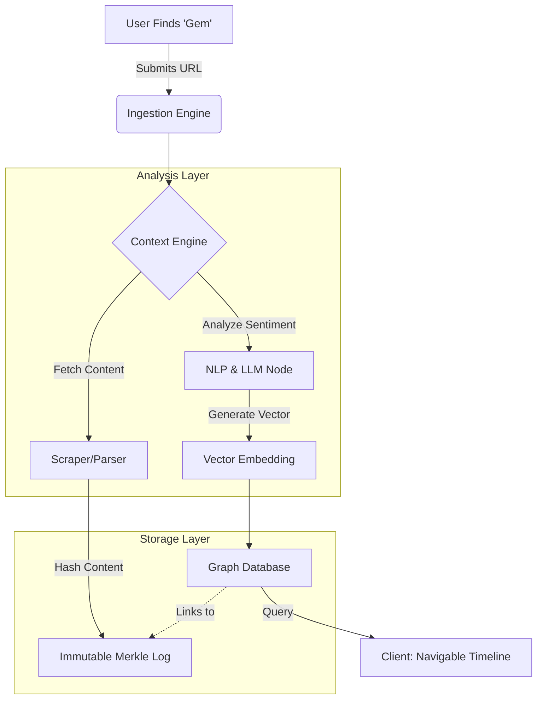

| RFC ID | RFC-0001 |
| :--- | :--- |
| **Title** | Digital Provenance Protocol (DPP): A Standard for Temporal Semantic Anchoring |
| **Status** | Draft / Request for Comments |
| **Author** | Michael CP |
| **Created** | 2025-12-10 |
| **License** | MIT / CC-BY-4.0 |

## 1. Abstract

The **Digital Provenance Protocol (DPP)** is a system design for anchoring digital content in time, preserving not only the content itself but the semantic context ("zeitgeist") of the moment it was captured. Unlike traditional archiving, which takes static snapshots of data, DPP treats content as **Mile Markers**; nodes in a navigable, temporal graph. This allows systems to trace the evolution of public discourse and sentiment around specific topics (e.g., a culinary trend or political event) over decades. This specification outlines a centralized, verifiable ledger system using Merkle structures to ensure high-throughput queryability and integrity.

## 2. Problem Statement

### 2.1 Context Decay
The current internet suffers from "Context Decay." When a user retrieves an archived URL from 10 years ago, they view the content through the lens of the present day. The metadata of that era, how the content was received, its controversy level, and its relationship to other concurrent events, is lost.

### 2.2 Static vs. Semantic History
Tools like the Wayback Machine preserve the *presentation layer* (pixels and text). However, there is no standard protocol for preserving the *semantic layer* (sentiment, cultural significance, and vector embeddings) at a specific point in time (`t_0`). Current systems reduce context to cheap, attention-driven, mechanics (i.e. points, badges/awards, leaderboards) which only provide a vague reflection of meaning.

### 2.3 Goals
* **Temporal Navigation:** Enable users to traverse a topic backward and forward in time to see how sentiment evolved.
* **Verifiable Integrity:** Ensure that once a timestamp and sentiment score are recorded, they cannot be altered (without the overhead of blockchain).
* **Interoperability:** Create a standard JSON schema for "Mile Markers" that different platforms can consume.

## 3. Terminology

| Term | Definition |
| :--- | :--- |
| **Gem** | The atomic unit of content being indexed (e.g., a URL, an image, a video, or a text snippet). |
| **Mile Marker** | A rigid, timestamped container that wraps a Gem. It includes the content hash, the semantic analysis, and a pointer to the previous marker. |
| **Strand** | A threaded collection of Mile Markers sharing a specific semantic topic (e.g., The "Pizza Toppings" Strand). |
| **Cultural Vector** | A high-dimensional embedding representing the sentiment and cultural context of the Gem at the time of capture. |
| **Anchor Log** | An append-only Merkle Log (similar to Certificate Transparency logs) used to verify the order of entries. |

## 4. System Architecture

The protocol operates on three layers: **Ingestion**, **Contextualization**, and **Storage**.

### 4.1 Architecture Diagram


### 4.2 The "No Blockchain" Consensus

DPP prioritizes query speed and graph traversability over decentralized censorship resistance.

**Integrity:** We utilize a Merkle DAG (Directed Acyclic Graph) similar to Git. Every Mile Marker contains the hash of the previous marker in its Strand. To alter a record in 1985, one would have to recompute the hashes of every subsequent record up to the present day.

Performance: By avoiding Proof-of-Work or Proof-of-Stake, the system allows for real-time ingestion and instant graph traversal.

## 5. Data Specification

The core of the protocol is the Mile Marker. Below is the proposed JSON schema.

```
{
  "marker_id": "mm_uuid_v4",
  "schema_version": "1.0",
  "timestamp": "1985-10-26T09:00:00Z",
  "gem": {
    "original_url": "[https://example.com/article/pizza-trends](https://example.com/article/pizza-trends)",
    "content_hash": "sha256:e3b0c44298fc1c149afbf4c8996fb92427ae41e4649b934ca495991b7852b855",
    "media_type": "text/html"
  },
  "semantic_context": {
    "topics": ["pizza", "pineapple", "culinary_trends"],
    "sentiment_score": -0.8, 
    "sentiment_label": "controversial",
    "zeitgeist_summary": "Public discourse frames pineapple on pizza as a radical, largely unpopular deviation from tradition.",
    "vector_embedding": [0.124, -0.982, 0.004, "...", 0.551]
  },
  "provenance": {
    "previous_marker_hash": "sha256:89723...", 
    "contributor_id": "user_123"
  }
}
```

## 6. Usage Example: The "Pizza Strand"

To illustrate the protocol, consider the Pizza Trend Strand.

**Node A (1985):** A user submits a newspaper clipping about Hawaiian pizza.
    *Sentiment:* "Radical," "Unusual."
    *Vector:* Located near "Novelty Food."

**Node B (2005):** A user submits a blog post about ordering pizza for a party.
    *Sentiment:* "Standard," "Accepted."
    *Vector:* Located near "Fast Food Staples."
    *Link:* Node B references Node A as a historical predecessor.

**Node C (2024):** A viral video debating toppings.
    *Sentiment:* "Meme," "Divisive."
    *Vector:* Located near "Internet Culture."

**Query Result:** A client querying this Strand does not just see three links. They receive a **Gradient of Acceptance**, visualizing how the concept moved from "Novelty" to "Staple" to "Meme" over 40 years.

## 7. Future Work
    **Federation:** allowing different DPP servers to cross-reference Strands.
    **Tombstoning:** A privacy-compliant method for redacting "Gems" (e.g., right to be forgotten) while maintaining the integrity of the hash chain (replacing content with a null value but keeping the hash).

>[!NOTE] This specification is a living document. Contributions regarding the vectorization schema are welcome in the issues tab.
